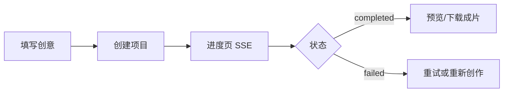
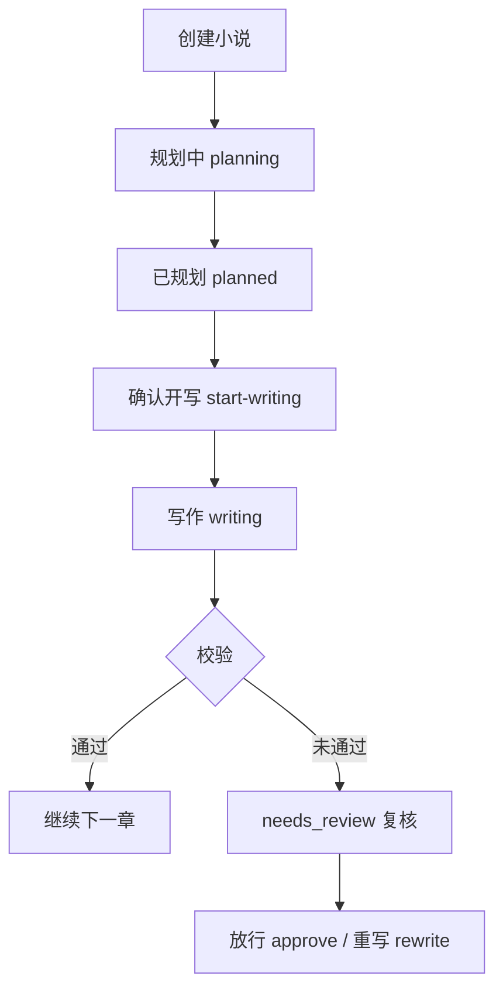

# 使用指南

> @author zhangzhihao

面向**使用者与运维**的操作说明。安装与部署见 [deployment.md](./deployment.md)；代码结构见 [codebase.md](./codebase.md)。

## 安全提示（必读）

- **切勿**将 `backend/.env`、`frontend/.env` 提交到 Git（已在 `.gitignore` 中忽略）。
- 文档与示例中 **API Key 一律使用占位符**（如 `your_agnes_api_key`），请只在本地 `.env` 填写真实密钥。
- 若密钥曾误提交，请立即在厂商控制台**轮换/作废**该 Key。

---

## 1. 本地快速体验（无需付费 API）

默认 Provider 为 `mock`，无需配置 DeepSeek / Agnes 等 Key。

```bash
# 终端 1 — 后端
cd backend
cp .env.example .env    # 保持 mock 即可
pip install -r requirements.txt
uvicorn app.main:app --reload --port 8000

# 终端 2 — 前端
cd frontend
npm install
npm run dev
```

浏览器打开 http://localhost:5173 。

| 页面 | 路径 | 作用 |
|------|------|------|
| 首页 Hub | `/` | 入口、进行中任务、产品线卡片 |
| 视频创作 | `/video` | 输入创意、选风格/时长/版式 |
| 视频进度 | `/video/progress/:id` | 实时进度、分镜预览、失败重试 |
| 小说创作 | `/novel` | 题材 + 创意 + 目标章数 |
| 小说工作台 | `/novel/:id` | 规划/写作/大纲/改稿 |
| 图文创作 | `/article` | 主题 + 平台 → 预览占位稿 |
| 我的作品 | `/library` | 视频/小说列表、失败重试 |
| 登录 | `/login` | 仅 `AUTH_ENABLED=true` 时需要 |

开发环境下 Vite 已将 `/api`、`/outputs` 代理到 `http://localhost:8000`。

---

## 2. 视频线使用流程



1. **创建**：顶栏「视频」→ 输入故事（必填）→ 选风格、时长、版式 →「开始创作」。
2. **进度**：自动跳转进度页；进度通过 SSE 推送，断线时会降级轮询。
3. **成片**：状态 `completed` 后播放/下载；开发环境成片 URL 形如 `/outputs/{projectId}/final.mp4`。
4. **失败**：进度页或作品库中点击「重试」→ 调用 `POST /api/projects/{id}/retry`。
5. **删除**：API `DELETE /api/projects/{id}`（进行中的项目返回 409）。

**生产出真片**：在 `backend/.env` 配置 Agnes 等 Provider，详见 [deployment.md](./deployment.md)。需安装 **FFmpeg** 并加入 PATH。

---

## 3. 小说线使用流程



1. **创建**：顶栏「小说」→ 选题材、填创意、目标章数 → 提交后进入**规划**（后台任务）。
2. **等待规划**：工作台或 Hub「进行中」可见；规划完成后状态为 `planned`。
3. **确认大纲**：左栏「规划」导航查看世界观/卷弧/大纲；满意后点击「确认规划并开始写作」。
4. **续写**：写作完成后可「续写下一章」；大纲超过 50 章时分页加载。
5. **复核章**：校验未通过时为 `needs_review`，需「放行本章」或「重写本章」后才能继续。
6. **改稿对话**：侧栏 chat 可改大纲/设定（会同步 DB 大纲）。
7. **导出**：工作台下载 MD/TXT（`/api/novels/{id}/export?format=md|txt`）。
8. **规划失败**：`POST /api/novels/{id}/retry-plan` 断点续跑规划。

**生产真 LLM 正文**：配置 `NOVEL_LLM_PROVIDER` 与对应 Key（见 `.env.example`，**勿写入文档或提交仓库**）。

---

## 4. 图文线（预览占位）

当前为 **M4 占位**：生成结构化 Markdown 预览，尚未接入完整 LLM+配图 Pipeline。

1. 顶栏「图文」或 Hub 卡片 → 填写主题、目标平台、语气。
2. 提交后跳转预览页，展示占位正文。
3. 作品可通过 API 列表/删除（`GET/POST/DELETE /api/articles`）。

---

## 5. 我的作品库

路径：`/library`（支持 `?tab=video` / `?tab=novel`）。

| 能力 | 说明 |
|------|------|
| Tab 切换 | 视频 / 小说分开列表 |
| 条件轮询 | 仅有进行中任务时每 5s 刷新 |
| 失败视频 | 卡片上可「重试」 |
| 跳转 | 视频 → 进度页；小说 → 工作台 |

---

## 6. 鉴权模式（可选）

默认 `AUTH_ENABLED=false`，全员可用、数据不按用户隔离。

启用 SaaS 时在 **`backend/.env` 本地文件** 中设置（示例，非真实密钥）：

```env
AUTH_ENABLED=true
JWT_SECRET=请替换为至少32字符的随机字符串
```

| 步骤 | 操作 |
|------|------|
| 1 | 前端打开 `/login` 注册或登录 |
| 2 | 前端自动在请求头附带 `Authorization: Bearer <token>` |
| 3 | 各用户只能看到 `owner_id` 匹配的作品 |

---

## 7. 生产环境要点（摘要）

完整说明见 [deployment.md](./deployment.md)。

| 项 | 说明 |
|----|------|
| 前端 API 地址 | `frontend/.env` 中 `VITE_API_BASE=https://你的API域名` 后 `npm run build` |
| 长任务 | `USE_CELERY=true` + Redis + Worker |
| SSE 跨进程 | Celery 模式下需 Redis（ProgressHub pub/sub） |
| 视频 Provider | Agnes Key 等仅写在服务器本地 `.env` |
| 小说 Provider | DeepSeek / 智谱 Key 仅写在服务器本地 `.env` |
| 健康检查 | `GET /api/health` ；`?deep=1` 探测 DB/Redis |

---

## 8. 常见问题

| 现象 | 处理 |
|------|------|
| 前端报「无法连接后端」 | 确认 `uvicorn` 在 8000 端口；或生产环境 `VITE_API_BASE` 是否正确 |
| 视频合成失败 / FFmpeg | 安装 FFmpeg 并加入 PATH（Windows: `winget install ffmpeg`） |
| 进度长时间不动 | 生产检查 Celery Worker；本地可看后端终端日志 |
| SSE 不更新但 DB 在变 | 生产需 Redis；或刷新页面依赖轮询降级 |
| 小说规划很慢 | 正常；千章级 L1/L2 耗时长，可看 SSE 进度 |
| 启用鉴权后 401 | 先 `/login`；请求需带 Bearer token |

---

## 9. API 交互式文档

后端启动后访问：

- Swagger UI：http://localhost:8000/docs
- OpenAPI JSON：http://localhost:8000/openapi.json

REST 路径前缀均为 `/api/...`。
